# Interpretability & Explainability with Random Forest

In the world of machine learning, interpretability and explainability are two therms commonly used to describe the leven of comprehension of an algorithm.
The distinction between them lies in their focus and depth.
We can say that interpretability focuses on understanding the inner workings of the models, while explainability focuses on explaining the decisions made.
Define i f an algorithm is interpretable or explainable dipend on different factors as described below.
 

**Model complexity** – When dealing with intricate models like Random Forest (with tens of variables and thousands of trees), up to deep neural networks, interpretability becomes challenging due to their complexity and the interplay among their components.
In such scenarios, explainability proves to be a more practical approach, as it focuses on clarifying decisions rather than delving into the complexities of the algorithm.

**Communication** – In terms of audience and purpose, interpretability primarily concerns machine learning specialists , whereas explainability targets end users seeking to grasp model decisions.
Consequently, explainability necessitates a more straightforward and intuitive communication of information.

While Random Forest (RF) is a powerful algorithm and often yield high accuracy, interpretability can be challenging due to its complex structure and the high number of tress.
However, the following techniques can enhance the interpretability and explainability of RF models.

-   **Interpretability** – A *surrogate model*, such as a single decision tree, can approximate the predictions of a more complex model like a RF, which is composed of thousands of decision trees.
    The surrogate model is more interpretable and helps in understanding the general rules that RF tipically follows.

-   **Explainability** – Examining *feature importance scores*, which measure the contribution of each variable to the model's predictions, allows us to identify the most influential variables in the model's decisions.
    In addition, *partial dependence plots* enable us to visualize how changes in a variable influence the model's predictions, making this tool useful for interpreting the global effects of predictors across the entire dataset.

## Aim of the present lab

In this computing lab you will work with the outputs of RF resulting from the previous lab on landslides susceptibility map.

-   Firstly, we will explore the relative importance of the predictor variables (feature importance scores) , and their relative probability of prediction success (partial dependence plots).
    These are the core of explainability in RF.

-   In the second part, we will apply a local version of RF (named "*Geographical Random Forest*") to analyse the spatial heterogeneity of the local variable importance.
    This will help to deep our understanding of the influence of the predictor variable explored locally,

## Computing lab: tools to comprehend RF

### Re-load libraries and workspace

If you have quit the workspace where you have run the RF model for landslide susceptibility mapping, you need to load it again in this new project.
Loading the workspace refers to the action of restoring the saved state of R environment.
When you save your workspace in R, it typically includes all the objects (such as variables, functions, data frames, etc.) that are currently present in your R session.
Loading the workspace means to restore this saved state, bringing back all the previously saved objects into your current R session.


```
##  [1] "RColorBrewer" "tidyr"        "randomForest" "classInt"     "plotROC"     
##  [6] "ggplot2"      "pROC"         "dplyr"        "readr"        "foreign"     
## [11] "terra"        "stats"        "graphics"     "grDevices"    "utils"       
## [16] "datasets"     "methods"      "base"
```

### Surrogate model

Although machine learning algorithms are often considered as a black box, with RF is possible to plot a sample tree (selected randomly) to analyse its structure and investigate how decisions have been made.


```r
library("party")

x <- ctree(LS~., data=LS_train)
plot(x, type="simple")
```

### Features importance score

RF provides two scores allowing to assess the importance of each variables in the model: the Mean Decrease in Accuracy (MDA), and the mean decrease in Gini index.
The MDA indicates how much the tree nodes that use a given variable enable reducing the mean-square errors evaluated on the Out-Of-Bag and across all the trees.
The Gini index measures the probability of incorrectly classifying a randomly chosen element in a dataset if that element were classified based on the distribution of classes in a particular node.
The relative importance of the predictor variables can be ranked based on the increasing values of both these scores: the higher the value, the more important the variable.


```r
# Display the plot with the relative importance of each variable
importance(RF_LS)
varImpPlot(RF_LS)
```

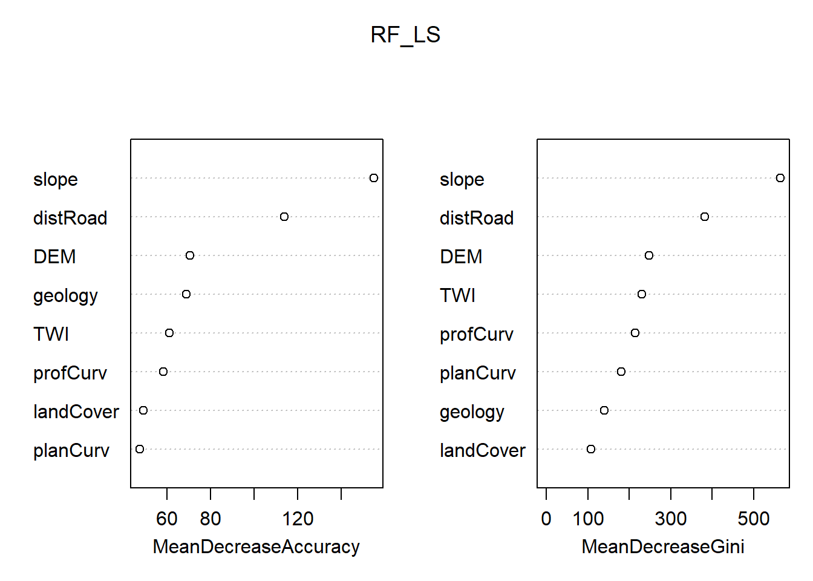

### Partial dependence plot

The Partial Dependence Plot (PDP) allows us to estimate, for each single variable, the relative probability of prediction success over different ranges of values.
PDP provides a graphical depiction of the marginal effect of each variable on the class probability over different ranges of continuous or discrete values.
Positive values are associated with the probability of occurrence of the phenomena (i.e., landslides presence), while negative vales indicate its absence.


```r
#Compute PDP for all the predictor variables 

# Slope
partialPlot(RF_LS, LS_train, x.var = slope, rug = TRUE, 
            which.class = RF_LS$classes[2],xlab= "Slope [°]", 
            main = "", ylab = "PDP")
```

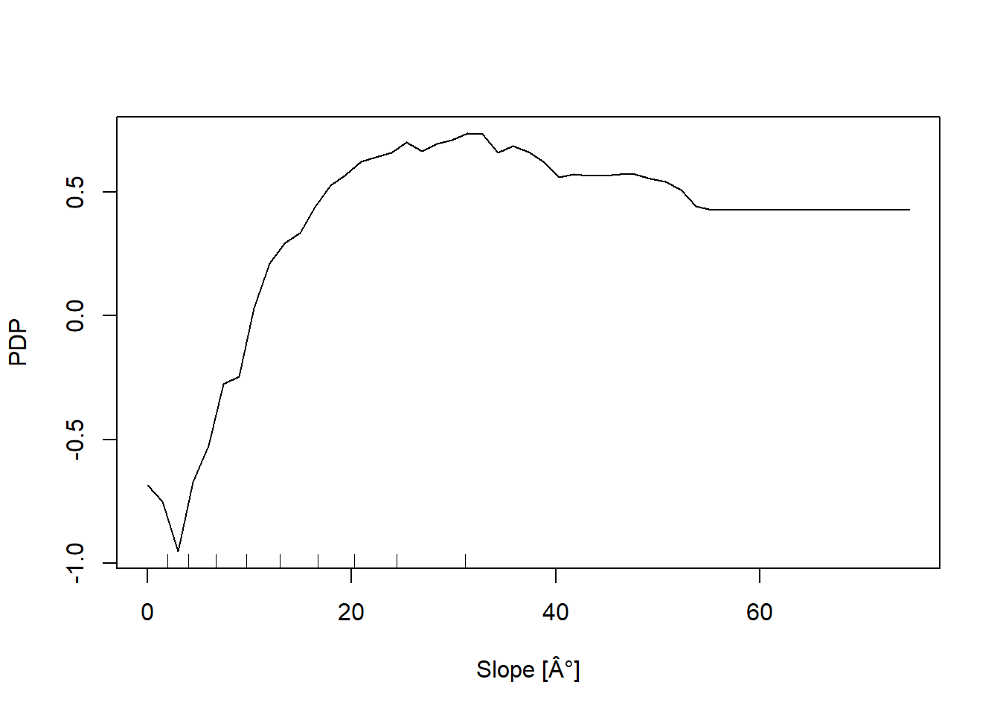

```r
# Elevation
partialPlot(RF_LS, LS_train ,x.var = DEM, rug = TRUE, 
            which.class = RF_LS$classes[2],xlab= "Elevation [m]", 
            main = "",ylab = "PDP")
```

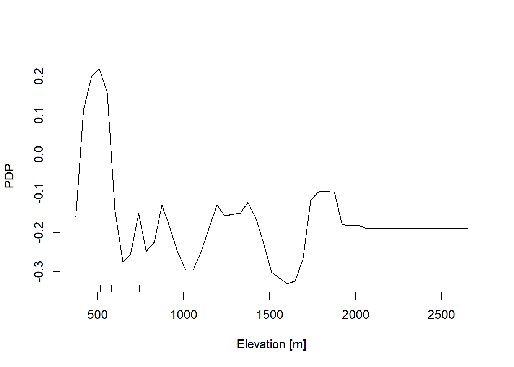

```r
# Profile curvature
partialPlot(RF_LS, LS_train, x.var = profCurv, rug = TRUE, 
            which.class = RF_LS$classes[2],xlab= "Profile curvature [1/m]", 
            main = "", ylab = "PDP", xlim = c(-0.1,0.1))
```

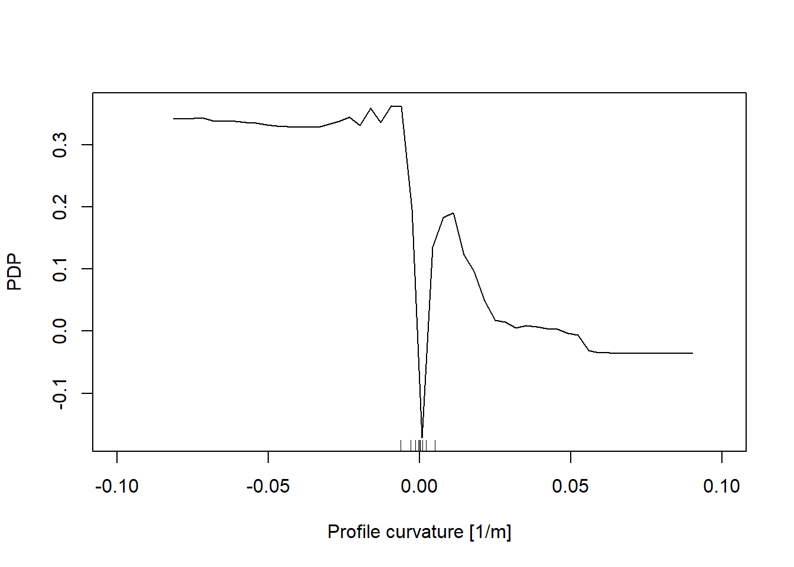

```r
# Plan Curvature
partialPlot(RF_LS, LS_train, x.var = planCurv, rug = TRUE, 
            which.class = RF_LS$classes[2],xlab= "Plan curvature [1/m]", 
            main = "", ylab = "PDP", xlim = c(-0.1,0.1))
```

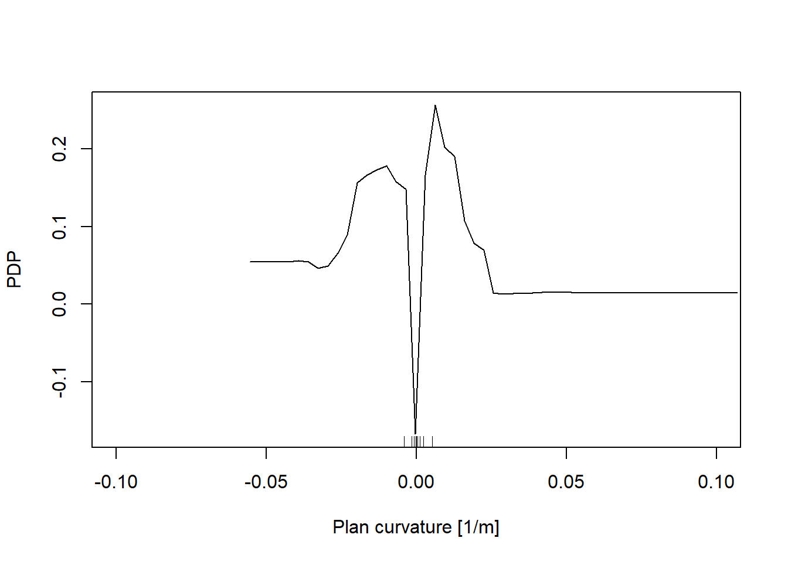

```r
# Distance to road
partialPlot(RF_LS, LS_train, x.var = distRoad, rug = TRUE, 
            which.class = RF_LS$classes[2],xlab= "Distance to road [m]", 
            main = "", ylab = "PDP")
```

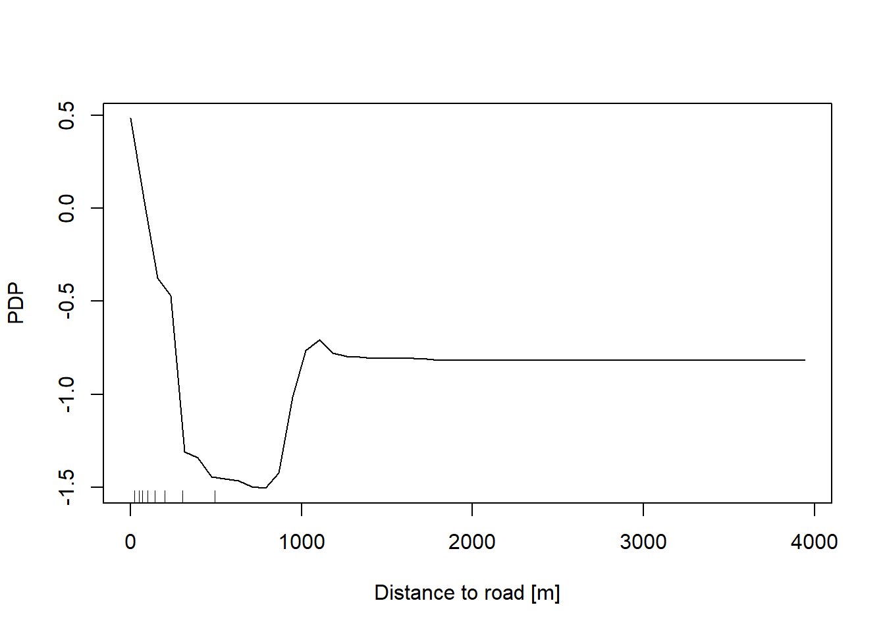

```r
# Topographic wetness index
partialPlot(RF_LS, LS_train, x.var = TWI, rug = TRUE, 
            which.class = RF_LS$classes[2],xlab= "TWI [-]", 
            main = "", ylab = "PDP")
```

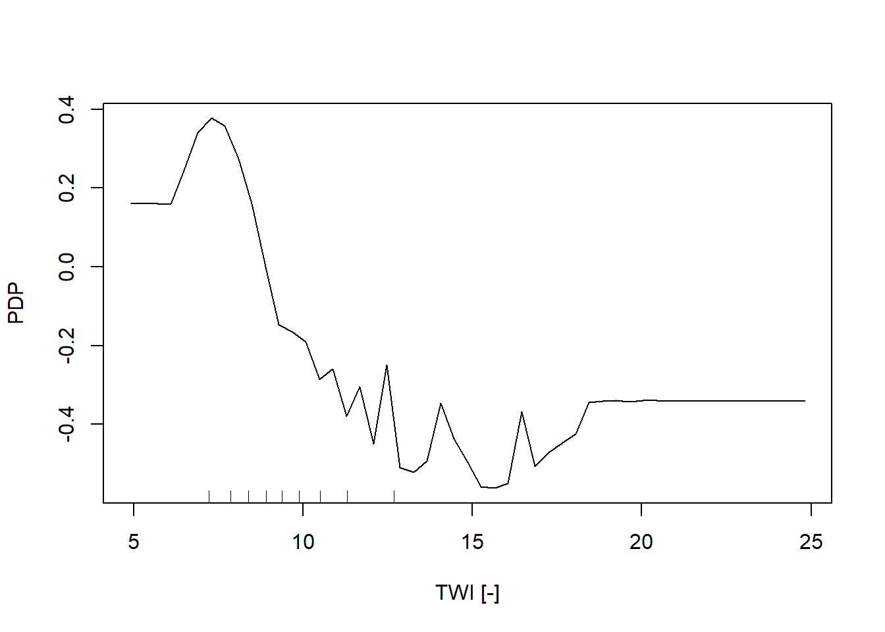

```r
# Geology
partialPlot(RF_LS, LS_train, x.var = geology, rug = TRUE, 
            which.class = RF_LS$classes[2],xlab= "Geology", 
            main = "", ylab = "PDP")
```

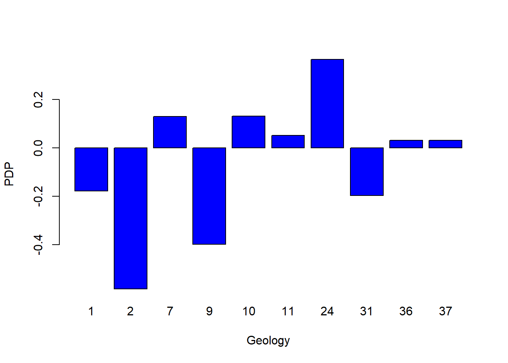

```r
# Land cover
partialPlot(RF_LS, LS_train, x.var = landCover, rug = TRUE, 
            which.class = RF_LS$classes[2],xlab= "Land Cover",
            main = "", ylab = "PDP")
```

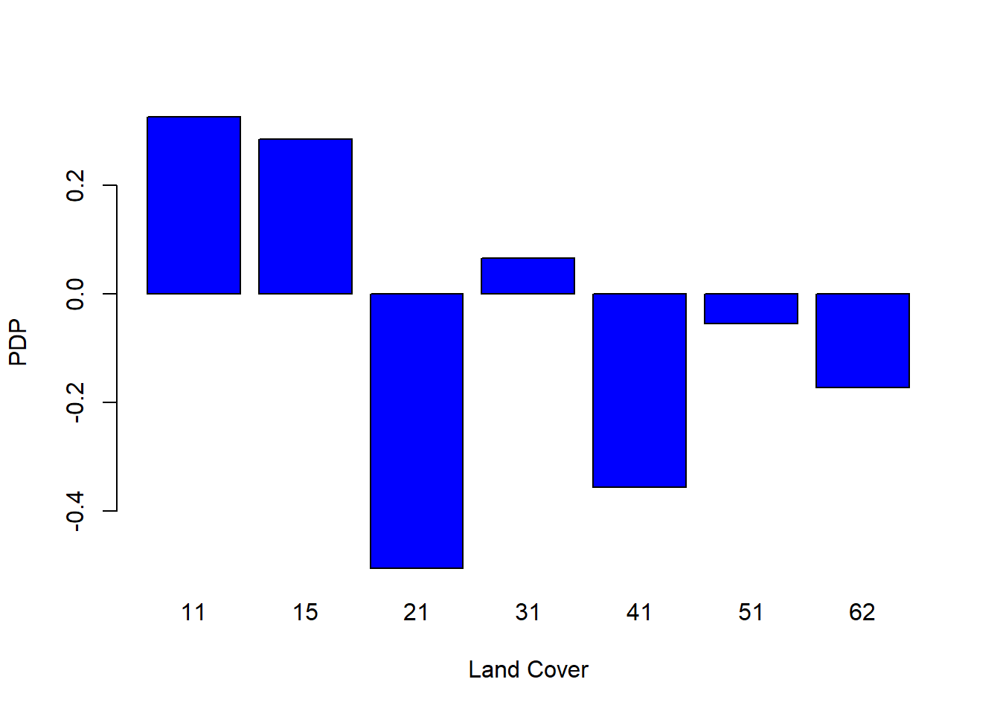

# Local Random Forest

Classical machine learning algorithms like Random Forest lack spatial calibration, hindering capturing the spatial heterogeneity in the relationship between a dependent and a set of independent variables.
To account for spatial heterogeneity (i.e. non-stationarity) on the spatial patterns distribution of hazardous events modeled as function of geographical features we can use local models.
Specifically, in the present work we explore the **local feature importance** of geographical independent predictor variables on the spatial distribution of landslides in canton Vaud (Switzerland).

We introduce **Geographical Random Forest** (GRF), a spatial analysis method which uses a local version of RF algorithm [@georganos_forest_2022] .
This is achieved by fitting a sub-model for each observation in space, taking into account the neighboring observations.
The GRF can model the non-stationarity coupled with a non-linear model (RF), which, compared to liner models, tends not to overfit due to its bootstrapping nature.
In addition RF is suited for datasets with numerous predictor variables.

Essentially, GRF was designed to be a bridge between machine learning and geographical models, combining inferential and explanatory power.

## Computing lab: GRF

For the computation we introduce here the method proposed by @Georganos_forest_2022 and implemented in the R package `SpatialML` [@SpatialML]

The function `grf` fitting a local version of the RF algorithm, has been implemented fro regression problem, so we need to transform our binary response variable (presence==1 / absence==0) to a numeric value which can assume a range of values from zero to one.


```
## 'data.frame':	5173 obs. of  11 variables:
##  $ distRoad : num  176.8 70.7 35.4 35.4 90.1 ...
##  $ DEM      : num  442 450 453 453 462 ...
##  $ landCover: Factor w/ 7 levels "11","15","21",..: 3 1 1 1 3 1 3 3 3 3 ...
##  $ TWI      : num  8.28 8.11 8.3 8.3 8.58 ...
##  $ planCurv : num  0.000814 -0.005182 -0.001086 -0.001086 -0.000253 ...
##  $ profCurv : num  0.01217 0.0041 -0.00189 -0.00189 -0.00121 ...
##  $ slope    : num  17.6 5.38 8.8 8.8 3.36 ...
##  $ geology  : Factor w/ 10 levels "1","2","7","9",..: 7 7 7 7 7 7 7 7 7 7 ...
##  $ x        : num  567850 568050 567950 567950 567850 ...
##  $ y        : num  2e+05 2e+05 2e+05 2e+05 2e+05 ...
##  $ LS       : Factor w/ 2 levels "0","1": 2 2 2 2 2 2 2 2 2 2 ...
##  - attr(*, "na.action")= 'omit' Named int [1:15] 2598 2771 2939 2985 3237 3409 3456 3615 4058 4216 ...
##   ..- attr(*, "names")= chr [1:15] "2598" "2771" "2939" "2985" ...
```

```
## 'data.frame':	4138 obs. of  12 variables:
##  $ distRoad : num  25 35.4 50 0 50 ...
##  $ DEM      : num  566 549 1151 1058 579 ...
##  $ landCover: Factor w/ 7 levels "11","15","21",..: 4 2 3 5 2 3 5 2 5 5 ...
##  $ TWI      : num  8.09 8.42 9.45 16.44 8.83 ...
##  $ planCurv : num  0.017138 0.001319 0.000871 -0.009321 -0.001597 ...
##  $ profCurv : num  -1.12e-02 3.92e-05 -3.13e-03 1.52e-02 4.64e-03 ...
##  $ slope    : num  5.49 15.33 13.87 5.05 10.35 ...
##  $ geology  : Factor w/ 10 levels "1","2","7","9",..: 1 1 1 2 1 1 1 1 5 1 ...
##  $ x        : num  558650 536550 560850 515450 535550 ...
##  $ y        : num  145400 154500 148400 168900 156800 ...
##  $ LS       : Factor w/ 2 levels "0","1": 2 2 2 1 1 2 1 2 1 2 ...
##  $ LSregr   : num  1 1 1 0 0 1 0 1 0 1 ...
##  - attr(*, "na.action")= 'omit' Named int [1:15] 2598 2771 2939 2985 3237 3409 3456 3615 4058 4216 ...
##   ..- attr(*, "names")= chr [1:15] "2598" "2771" "2939" "2985" ...
```

```
## 'data.frame':	1035 obs. of  12 variables:
##  $ distRoad : num  79.1 111.8 35.4 35.4 25 ...
##  $ DEM      : num  484 1060 847 556 1327 ...
##  $ landCover: Factor w/ 7 levels "11","15","21",..: 3 5 2 3 3 3 2 5 1 3 ...
##  $ TWI      : num  10.9 11.2 10.1 10.5 10.2 ...
##  $ planCurv : num  -0.002085 -0.000343 -0.000788 0.000117 -0.001574 ...
##  $ profCurv : num  -0.001125 0.000457 0.001293 -0.000683 -0.002214 ...
##  $ slope    : num  14.39 1.97 15.91 4.74 20.62 ...
##  $ geology  : Factor w/ 10 levels "1","2","7","9",..: 7 1 7 1 1 1 1 2 7 1 ...
##  $ x        : num  529950 518550 552950 543550 572150 ...
##  $ y        : num  160700 165100 148200 174100 136000 ...
##  $ LS       : Factor w/ 2 levels "0","1": 2 1 2 1 2 1 2 1 2 1 ...
##  $ LSregr   : num  1 0 1 0 1 0 1 0 1 0 ...
##  - attr(*, "na.action")= 'omit' Named int [1:15] 2598 2771 2939 2985 3237 3409 3456 3615 4058 4216 ...
##   ..- attr(*, "names")= chr [1:15] "2598" "2771" "2939" "2985" ...
```


```r
Coords<-LS_train[,9:10] # define coordinates

# Run GRF

set.seed(123) # initialize 

gwRF_LS<-grf(LSregr~distRoad+DEM+landCover+TWI+planCurv+profCurv+slope+geology,  LS_train, bw=40, mtry=3, kernel="adaptive",coords=Coords)
```

```
## Ranger result
## 
## Call:
##  ranger(LSregr ~ distRoad + DEM + landCover + TWI + planCurv +      profCurv + slope + geology, data = LS_train, num.trees = 500,      mtry = 3, importance = "impurity", num.threads = NULL) 
## 
## Type:                             Regression 
## Number of trees:                  500 
## Sample size:                      4138 
## Number of independent variables:  8 
## Mtry:                             3 
## Target node size:                 5 
## Variable importance mode:         impurity 
## Splitrule:                        variance 
## OOB prediction error (MSE):       0.1179855 
## R squared (OOB):                  0.5281665 
##  distRoad       DEM landCover       TWI  planCurv  profCurv     slope   geology 
## 189.03796 118.23180  42.58344 112.62676  86.64094 103.52100 275.56255  45.92905 
##     Min.  1st Qu.   Median     Mean  3rd Qu.     Max. 
## -1.00000 -0.03989  0.00000 -0.02352  0.01996  1.00000 
##       Min.    1st Qu.     Median       Mean    3rd Qu.       Max. 
## -0.5771719 -0.0038917  0.0000000 -0.0004654  0.0030000  0.4914078 
##           Min      Max      Mean       StD
## distRoad    0 5.057082 0.6840634 0.8651427
## DEM         0 5.097790 0.8308835 0.8286699
## landCover   0 3.263085 0.2288518 0.3818137
## TWI         0 4.108891 0.6034478 0.6340272
## planCurv    0 3.295054 0.4977787 0.4819980
## profCurv    0 4.177866 0.4866789 0.5209168
## slope       0 4.749768 0.8323274 0.8537186
## geology     0 4.923056 0.2181370 0.3916300
```

```r
saveRDS(gwRF_LS, "gwRF_LS.rds")
```

### Feature importance

#### Global variable importance plot

Based on the results of the GRF, we can plot of the variable importance ranking for illustrative purposes.
Values came from "`Global ML Model Summary`" --\> "`Importance`"


```r
# Create a data frame with variable names and importance values
variable_importance <- data.frame (
  Variable = c("distRoad", "DEM", "landCover", "TWI", "planCurv", "profCurv", "slope", "geology"),
  Importance = c(181.18490, 114.32444,  34.23643, 101.51863,  84.81667, 125.93651, 297.74411,  39.22721 ) # Importance - Global ML
)

# Assign different colors to the top three important variables
variable_importance$Color <- ifelse(variable_importance$Importance >= sort(variable_importance$Importance, decreasing = TRUE)[3], "orange", "skyblue")

# Create a bar plot for variable importance with different colors for the top three variables
ggplot(data = variable_importance, aes(x = Variable, y = Importance, fill = Color)) +
  geom_bar(stat = "identity") +
  scale_fill_identity() +
  labs(title = "Variable Importance Plot", x = "Variable", y = "Importance") +
  theme(axis.text.x = element_text(angle = 45, hjust = 1))  # Rotate x-axis labels for better readability
```

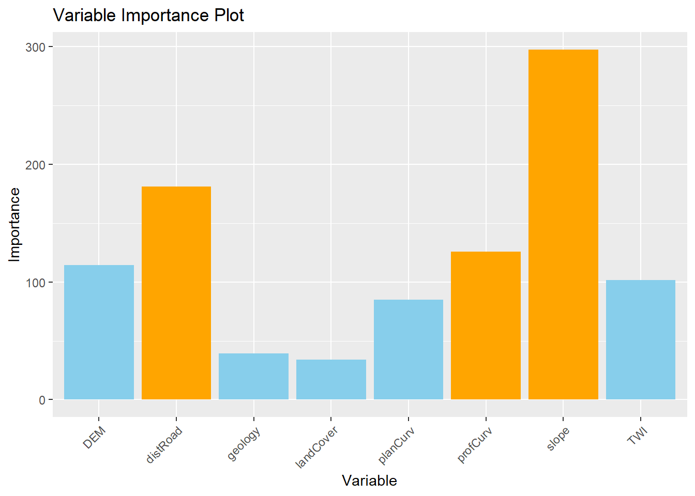

#### Local feature importance

We can plot the local feature importance scores for the two variables that are globally most important, the slope and the distance to road, with the output values mapped over the geographic space.


```r
# Create a data frame with the values of the local variables importance and the coordinates for each location
gwRF_LS_var<-gwRF_LS$Local.Variable.Importance
gwRF_LS_var_XY<-cbind(gwRF_LS_var,LS_train$x,LS_train$y ) # add coordinates
colnames(gwRF_LS_var_XY)[9]<- "X" #rename column X-coordinate 
colnames(gwRF_LS_var_XY)[10]<- "Y" #rename column Y-coordinate 
str(gwRF_LS_var_XY) 
```

```
## 'data.frame':	4138 obs. of  10 variables:
##  $ distRoad : num  0.0562 0.271 0.383 0.0165 0.2723 ...
##  $ DEM      : num  0.0427 0.8705 0.9203 0.5591 2.3373 ...
##  $ landCover: num  0.22036 0.04229 0.08014 0.00167 0.43775 ...
##  $ TWI      : num  0.1152 0.6513 0.4731 0.0766 1.3823 ...
##  $ planCurv : num  0.00755 0.59866 1.06332 0.03534 0.66228 ...
##  $ profCurv : num  0.0725 0.2454 0.8325 0.2023 0.8722 ...
##  $ slope    : num  0.00984 1.67939 1.23443 0.02137 1.13352 ...
##  $ geology  : num  0.0107 0.2399 0.3959 0.3438 1.8822 ...
##  $ X        : num  558650 536550 560850 515450 535550 ...
##  $ Y        : num  145400 154500 148400 168900 156800 ...
```

```r
library(sf) #for spatial data operations
# Convert vector to sf (simple feature)
Vaud<-vect("data/RF/Vaud_CH.shp")
Vaud_sf<-st_as_sf(Vaud) 

# Output predicted values are transformed to a vector
pred.vect <- as.vector(gwRF_LS_var_XY$slope)

library(classInt) #for classification

brk<-(classIntervals(pred.vect, n=5, style = "fisher"))
brkInt<-round(brk$brks, digits=2)
print(brkInt)
```

```
## [1] 0.00 0.41 0.99 1.61 2.47 4.75
```

```r
#natural breaks (fisher)

ggplot() +
    geom_point(data = gwRF_LS_var_XY, aes(x = X, y = Y, colour = slope), size = 1) +
    scale_color_gradientn(colors = c("white", "orange","red", "blue"),  
                       breaks = c(0.00, 0.40, 1.15, 2.11, 3.23, 4.91), 
                       labels=c(0.00, 0.40, 1.15, 2.11, 3.23, 4.91)) +
        labs( x = "X Coordinate", y = "Y Coordinate")+
    ggtitle("Local average FI - Slope")+
    geom_sf(data = Vaud_sf, fill = "transparent", color = "black", size=2) #overlap borders
```

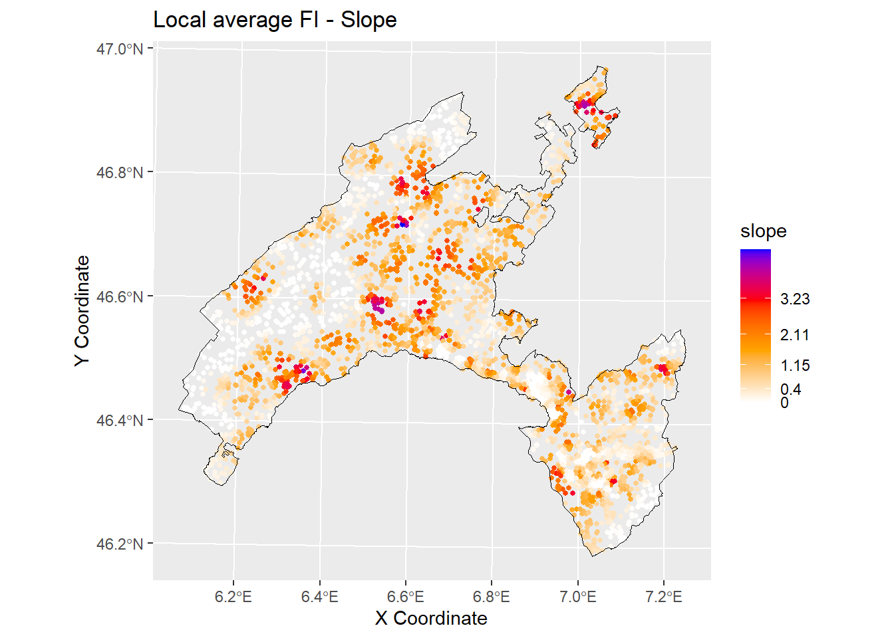


```r
# Output predicted values are transformed to a vector
pred.vect <- as.vector(gwRF_LS$Local.Variable.Importance$distRoad)
 
brk<-(classIntervals(pred.vect, n=5, style = "fisher"))
brkInt<-round(brk$brks, digits=2)
print(brkInt) # print breaks
```

```
## [1] 0.00 0.39 1.06 2.08 3.48 5.06
```

```r
#natural breaks (fisher)

ggplot() +
    geom_point(data = gwRF_LS_var_XY, aes(x = X, y = Y, colour = distRoad), size = 1) +
    scale_color_gradientn(colors = c("white", "orange","red", "blue"), 
                       breaks = c(0.00, 0.37, 1.02, 2.17, 3.58, 4.85), 
                       labels=c(0.00, 0.37, 1.02, 2.17, 3.58, 4.85)) +
    labs( x = "X Coordinate", y = "Y Coordinate")+
    ggtitle("Local average FI - Distance to roads")+
    geom_sf(data = Vaud_sf, fill = "transparent", color = "black", size=2) #overlap borders
```

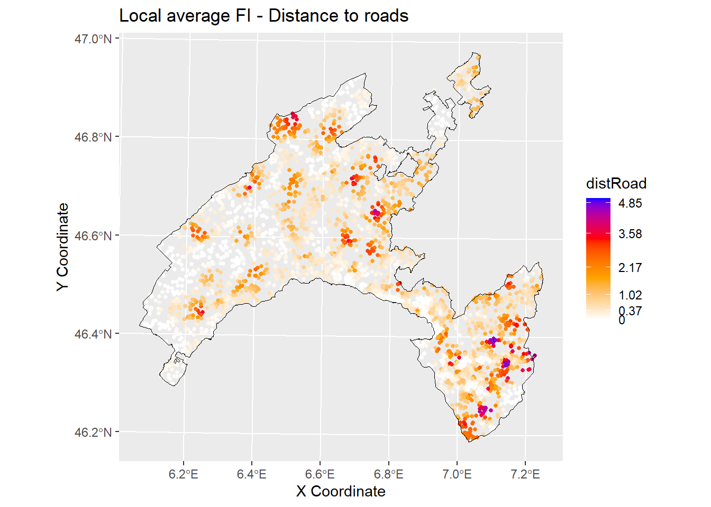

### Local R squared

The Local R-squared value represents the strength of the correlations of the local model on the predictor variables and ranges from 0 to 1.


```r
Rsq<-gwRF_LS$LGofFit$LM_Rsq100
Rsq_XY<-as.data.frame(cbind(Rsq,LS_train$x,LS_train$y)) # add coordinates
colnames(Rsq_XY)[2]<- "X"
colnames(Rsq_XY)[3]<- "Y"
str(Rsq_XY)
```

```
## 'data.frame':	4138 obs. of  3 variables:
##  $ Rsq: num  -0.258 0.537 -0.144 -0.255 0.322 ...
##  $ X  : num  558650 536550 560850 515450 535550 ...
##  $ Y  : num  145400 154500 148400 168900 156800 ...
```

```r
ggplot () +
  geom_point(data = Rsq_XY, aes(x = X, y = Y, colour = Rsq), size = 1)+ 
  scale_color_gradientn(colors = c("white", "yellow","red", "blue"))+
  labs(title = "Rsq", x = "X Coordinate", y = "Y Coordinate")+
  ggtitle("Local R2")+
  geom_sf(data = Vaud_sf, fill = "transparent", color = "black", size=2) #overlap borders
```

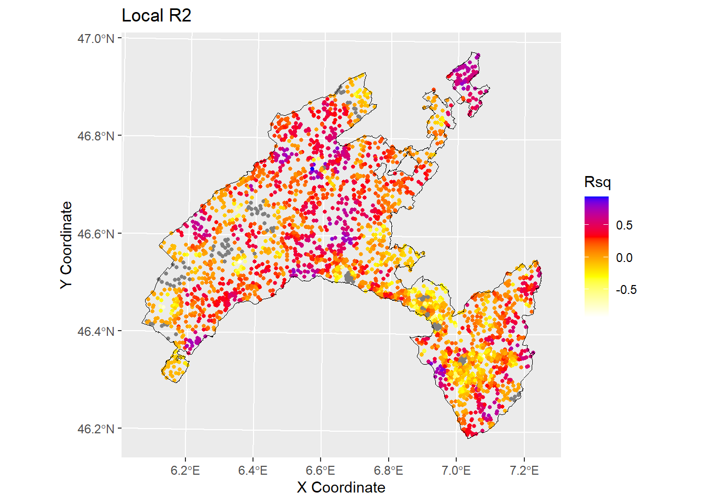

## Conclusions and further analyses

In the present exercise GRF has been used as a purely exploratory tool to estimate the spatial variation of the relationship between landslides in Canton Vaud (Switzerland) and the predictor variables.
It allowed to elaborate maps based on the local average importance of the most highly correlated features and to visualize the local fitting performance (R2 local value) into a map.

To ensure that everything is perfectly clear, we propose you to answer the following questions:

1.  Among the following algorithms evaluate them in therms of their interpretability and explainability: Support Vector Machines , linear regression, Deep Learning Models, Decision Trees, K-Nearest Neighbors, Neural Networks, Random Forests, logistic regression.

2.  Which are the three most important variables of your model (based on the MDA)?

3.  What is the slope value (or range of values) that gives the highest probability of landslides occurrence?
    And for the geology, which are the most important classes?

4.  Evaluate the spatial variation of the relationship between landslides and slope / distance to roads in your study area by visually inspecting the local average importance of these features.

5.  You can replicate this code (some chiuncks of it) to evaluate the local average importance of the third most important variable, as well as to map the local mean squared error.
