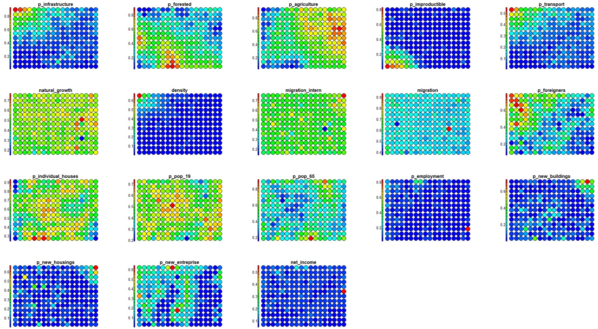

# Defining Territorial Typologies Using Unsupervised Learning: A SOM Approach {#som}

Urban expansion across Europe has accelerated in recent decades, significantly blurring the distinctions between urban and rural landscapes.
The growing complexity and constant evolution of territorial dynamics require timely urban-rural typologies that systematically classify areas along the continuum from distinctly urban to distinctly rural.
Traditional threshold-based classification methods rely heavily on expert input and are labor-intensive, hindering timely updates.
This study addresses the issue by developing an unsupervised learning approach based on **Self-Organizing Map (SOM)** [@kohonen_self-organized_1982] to group Swiss municipalities, using a diverse set of demographic, socioeconomic, and built environment variables.

## Geo-demographic context in Switzerland

Switzerland has the highest life expectancy in the world.
It counts about 8,5 million inhabitants (official census data 2020), twice as much as at the beginning of the 20th century, mainly because of the high level of immigration.
The number of foreigners that currently reside in the country corresponds to about one quarter of the total population.
Most of the population (85%) lives in cities.
Population aging increased over the course of the 20th century, with one in five person of retirement age today.

### Swiss census data

The input census data used in this study come from the [Swiss Federal Statistical Office](https://www.bfs.admin.ch/bfs/en/home.html) and have been downloaded from the Statistical Atlas of Switzerland [@FSO_2024].
Following an in-depth analysis of all data available in the Atlas, eighteen variables from the 2020 census were selected.
These variables provide a comprehensive overview of the physical environment (including settlement, forest, agricultural, unproductive, and traffic areas), demographic characteristics (such as natural growth, population density, international and internal migration, proportion of foreigners, youth, and senior population), and the socio-economic profile (covering employment, new buildings, new houses, individual housing, new enterprises, and net income) of the resident population.
This information has been aggregated to the municipality level for the purpose of the present investigation.

## Self Organizing Map

We use SOM, an unsupervised competitive learning neural network allowing representing a high-dimensional feature space (defined by the multivariate input dataset), as two-dimensional discretized pattern (the SOM grid of neurons).
In SOM the proximity of the units in the output grid reflects the similarity of the corresponding input observations, which guarantees the preservation of the topological structure of the input data.

Compared to other approaches, SOM is very efficient for data visualization.
Indeed it provides additional outputs such as the heatmaps, representing the distribution of each input feature across the SOM grid, extremely useful to visually explore the relationship between the input variables.

## Computing lab: SOM

### Load the libraries

To perform the analyses and visualize the results you have to load the following libraries:

-   *kohonen*: Supervised and Unsupervised Self-Organizing Maps (SOM)
-   *aweSOM***:** offers a set of tools to explore and analyze datasets with SOM
-   *ggplot2*: create Elegant Data Visualizations Using the Grammar of Graphics
-   *colorpatch*: rendering methods (ggplot extensions)


``` r
library(kohonen)
library(aweSOM)
library(ggplot2)
library(colorpatch)
(.packages())
```
### Import the Swiss census dataset

Fist, you have to import the Swiss census dataset for the year 2020, referred to the municipality administrative units.
As you can see from the description of the selected variables \autoref{Variables}, some of them can be discarded from the analysis.
So, in the following step, we extract a subset of the most meaningful variables for the purpose of the present study.


``` r
knitr::include_graphics(c("images/Variables1.jpg", "images/Variables2.jpg"))
```

\begin{figure}

{\centering \includegraphics[width=1\linewidth,height=1\textheight]{images/Variables1} 

}

\caption{Variables description \label{Variables}}(\#fig:variables-1)
\end{figure}
\begin{figure}

{\centering \includegraphics[width=1\linewidth,height=1\textheight]{images/Variables2} 

}

\caption{Variables description \label{Variables}}(\#fig:variables-2)
\end{figure}


#### Inspect the data

Histograms can be used to show the frequency distribution of the variables and help detect patterns, such as skewness, outliers, and the range of values. Similarly, box plots summarize data using quartiles, helping to identify central tendency, spread, and outliers. Together, these visual tools allow to asses if variables have comparable ranges and help determine if data transformation is needed.


``` r
# Plot variables' frequency distribution
for(i in 3:ncol(subset2020)) {      
    hist((subset2020[ , i]),  main=colnames(subset2020[i]))
}
```


``` r
# Plot variables' frequency distribution
for(i in 3:ncol(subset2020)) {      
    boxplot((subset2020[ , i]),  main=colnames(subset2020[i]))
}
```
#### Data transformation 
To make the variables range comparable, we propose to operate the max-min normalization scaling input census data in the range [0 – 1]. Computationally it subtracts the minimum value from the original one, and then it divides the result by the range (i.e., difference between the maximum and minimum values). This process ensures that all variables in the dataset are in the same range, and can be treated and evaluated together.

However, the min-max transformation is sensitive to outliers, as extreme values can distort the interpretation by compressing the range. To mitigate this, values beyond the upper and lower 5th percentiles will be capped at these thresholds before operating the max-min normalization. 


``` r
# Define the general function to detect outlier
replace_outliers <- function(df, lower_quantile_value, upper_quantile_value) {
  replaced_df <- df
  for (col in names(df)) {
    lower_quantile <- quantile(df[[col]], probs = lower_quantile_value)
    upper_quantile <- quantile(df[[col]], probs = upper_quantile_value)
    outlier_indices_lower <- df[[col]] < lower_quantile
    outlier_indices_upper <- df[[col]] > upper_quantile
    replaced_df[[col]][outlier_indices_lower] <- lower_quantile
    replaced_df[[col]][outlier_indices_upper] <- upper_quantile
  }
  return(replaced_df)
}

# Define the percentile level
lower_quantile_value <- 0.05
upper_quantile_value <- 0.95

# Replace outliers in all variables with upper and lower quantile values

df2020_out_repl <- replace_outliers((subset2020[ , -c(1,2)]), lower_quantile_value, upper_quantile_value)
summary (df2020_out_repl)
```

```
##  p_infrastructure    p_forested      p_agriculture    p_improductible   
##  Min.   :0.01906   Min.   :0.07797   Min.   :0.1030   Min.   :0.000000  
##  1st Qu.:0.06232   1st Qu.:0.20751   1st Qu.:0.3190   1st Qu.:0.003188  
##  Median :0.10815   Median :0.31211   Median :0.4694   Median :0.010854  
##  Mean   :0.15093   Mean   :0.32368   Mean   :0.4492   Mean   :0.056692  
##  3rd Qu.:0.20430   3rd Qu.:0.42620   3rd Qu.:0.5970   3rd Qu.:0.047372  
##  Max.   :0.48058   Max.   :0.61755   Max.   :0.7312   Max.   :0.402194  
##   p_transport      natural_growth       density        migration_intern 
##  Min.   : 0.7136   Min.   :-9.0172   Min.   :  16.42   Min.   :-24.648  
##  1st Qu.: 1.9811   1st Qu.:-2.1720   1st Qu.:  82.34   1st Qu.: -7.159  
##  Median : 3.2459   Median : 0.8865   Median : 189.46   Median :  2.575  
##  Mean   : 4.1497   Mean   : 0.7120   Mean   : 374.19   Mean   :  3.904  
##  3rd Qu.: 5.4475   3rd Qu.: 3.9575   3rd Qu.: 480.88   3rd Qu.: 13.534  
##  Max.   :11.9374   Max.   : 9.2336   Max.   :1662.06   Max.   : 37.746  
##    migration       p_foreigners    p_individual_houses    p_pop_19    
##  Min.   :-5.896   Min.   : 4.419   Min.   :32.94       Min.   :14.83  
##  1st Qu.: 0.000   1st Qu.: 9.736   1st Qu.:51.46       1st Qu.:18.61  
##  Median : 3.389   Median :15.432   Median :61.54       Median :20.53  
##  Mean   : 4.071   Mean   :16.915   Mean   :59.55       Mean   :20.44  
##  3rd Qu.: 7.250   3rd Qu.:23.487   3rd Qu.:68.93       3rd Qu.:22.38  
##  Max.   :17.350   Max.   :35.327   Max.   :78.69       Max.   :25.47  
##     p_pop_65      p_employment     p_new_buildings  p_new_housings   
##  Min.   :13.22   Min.   :0.07255   Min.   :0.0000   Min.   : 0.0000  
##  1st Qu.:16.60   1st Qu.:0.14204   1st Qu.:0.3201   1st Qu.: 0.5315  
##  Median :19.16   Median :0.22970   Median :1.2799   Median : 3.0057  
##  Mean   :19.51   Mean   :0.28020   Mean   :1.7691   Mean   : 5.0709  
##  3rd Qu.:21.95   3rd Qu.:0.36167   3rd Qu.:2.6316   3rd Qu.: 7.2601  
##  Max.   :27.60   Max.   :0.75642   Max.   :6.2107   Max.   :21.1283  
##  p_new_entreprise     net_income   
##  Min.   :0.000000   Min.   :25908  
##  1st Qu.:0.000000   1st Qu.:30789  
##  Median :0.002931   Median :34960  
##  Mean   :0.002806   Mean   :36848  
##  3rd Qu.:0.004514   3rd Qu.:40433  
##  Max.   :0.007919   Max.   :59032
```


``` r
# Define the general function for min-max normalization
minMax <- function(x) {
  (x - min(x)) / (max(x) - min(x))
}

# Apply max-min to the data
dfnorm2020_out_repl<- as.data.frame(lapply((df2020_out_repl), minMax))
summary(dfnorm2020_out_repl)
```

```
##  p_infrastructure    p_forested     p_agriculture    p_improductible   
##  Min.   :0.00000   Min.   :0.0000   Min.   :0.0000   Min.   :0.000000  
##  1st Qu.:0.09373   1st Qu.:0.2401   1st Qu.:0.3439   1st Qu.:0.007927  
##  Median :0.19304   Median :0.4339   Median :0.5833   Median :0.026987  
##  Mean   :0.28573   Mean   :0.4554   Mean   :0.5510   Mean   :0.140958  
##  3rd Qu.:0.40137   3rd Qu.:0.6454   3rd Qu.:0.7863   3rd Qu.:0.117785  
##  Max.   :1.00000   Max.   :1.0000   Max.   :1.0000   Max.   :1.000000  
##   p_transport     natural_growth      density        migration_intern
##  Min.   :0.0000   Min.   :0.0000   Min.   :0.00000   Min.   :0.0000  
##  1st Qu.:0.1129   1st Qu.:0.3751   1st Qu.:0.04005   1st Qu.:0.2803  
##  Median :0.2256   Median :0.5426   Median :0.10515   Median :0.4363  
##  Mean   :0.3061   Mean   :0.5331   Mean   :0.21740   Mean   :0.4576  
##  3rd Qu.:0.4218   3rd Qu.:0.7109   3rd Qu.:0.28224   3rd Qu.:0.6119  
##  Max.   :1.0000   Max.   :1.0000   Max.   :1.00000   Max.   :1.0000  
##    migration       p_foreigners    p_individual_houses    p_pop_19     
##  Min.   :0.0000   Min.   :0.0000   Min.   :0.0000      Min.   :0.0000  
##  1st Qu.:0.2536   1st Qu.:0.1720   1st Qu.:0.4048      1st Qu.:0.3560  
##  Median :0.3994   Median :0.3563   Median :0.6251      Median :0.5357  
##  Mean   :0.4288   Mean   :0.4043   Mean   :0.5816      Mean   :0.5273  
##  3rd Qu.:0.5655   3rd Qu.:0.6169   3rd Qu.:0.7866      3rd Qu.:0.7097  
##  Max.   :1.0000   Max.   :1.0000   Max.   :1.0000      Max.   :1.0000  
##     p_pop_65       p_employment    p_new_buildings   p_new_housings   
##  Min.   :0.0000   Min.   :0.0000   Min.   :0.00000   Min.   :0.00000  
##  1st Qu.:0.2344   1st Qu.:0.1016   1st Qu.:0.05153   1st Qu.:0.02516  
##  Median :0.4130   Median :0.2298   Median :0.20607   Median :0.14226  
##  Mean   :0.4373   Mean   :0.3036   Mean   :0.28485   Mean   :0.24001  
##  3rd Qu.:0.6069   3rd Qu.:0.4228   3rd Qu.:0.42372   3rd Qu.:0.34362  
##  Max.   :1.0000   Max.   :1.0000   Max.   :1.00000   Max.   :1.00000  
##  p_new_entreprise   net_income    
##  Min.   :0.0000   Min.   :0.0000  
##  1st Qu.:0.0000   1st Qu.:0.1474  
##  Median :0.3702   Median :0.2733  
##  Mean   :0.3543   Mean   :0.3303  
##  3rd Qu.:0.5701   3rd Qu.:0.4385  
##  Max.   :1.0000   Max.   :1.0000
```

### Run SOM

The main idea with SOM is to map the input high-dimensional feature space in a lower-dimensional output space organized on a grid made up of regular units (i.e. the neurons).
At the end of the process, each observation from the input space ($X_{k,i}$) will be associated (i.e., mapped) to a unit in the SOM grid.
Depending on the size of the grid, one unit can include several input observations.

The first step consists in defining the size and geometry of the SOM grid.
In this case we define a rectangular grid of 18 by 13 units, allowing to allocate, on average, about 15 input-items per units, and whose geometry reproduces the shape of the study area.
(NB: several parameters and configurations of the SOM grid can be implemented and compared, seeking to minimize the *Quantization Error, QE*).
Finally, you can run the SOM model.

For the computation we introduce here the method proposed by [@kohonen_self-organized_1982] and implemented in the R package `kohonen` [@library_SOM].

####Create the SOM-grid

Before running SOM, you have to transform the data frame to the format matrix and create the grid of output units.


``` r
mx2020<-as.matrix(dfnorm2020_out_repl) # max-min
```


``` r
# Gird size 18x13 units
som_grid <- somgrid(xdim = 20, ydim=15) 
```

The general R function `set.seed` is used for creating simulations of random objects that can be reproduced.
The `rlen` indicates the number of times the complete data set will be presented to the network, while for the other parameters we will keep the default values.


``` r
# Use max-min data transformation
set.seed(123) 

# Run SOM
SOM2020<- som(mx2020,
               grid=som_grid, 
               rlen=1000)
print(SOM2020)
```

```
## SOM of size 20x15 with a rectangular topology.
## Training data included.
```

#### Model evaluation

Finally, you can optimize the size of the grid by inspecting several quality measure and changing the parameters accordingly.
In particular we will explore the following:

-   **Changes**: shows the mean distance to the closest codebook vector during the training.
-   **Quantization error**: average squared distance between the data points and the map's codebook to which they are mapped. Lower is better.
-   **Percentage of explained variance**: similar to other clustering methods, the share of total variance that is explained by the clustering (equal to 1 minus the ratio of quantization error to total variance). Higher is better.


``` r
# Evaluate rlen
plot(SOM2020, type="changes")
```


\begin{center}\includegraphics{07-SOM_files/figure-latex/SOM-quality-1} \end{center}

``` r
# Evaluate the results
QEM<-somQuality(SOM2020, dfnorm2020_out_repl) 

## Quality measures:
QEM$err.quant # Quantization error
```

```
## [1] 0.311374
```

``` r
QEM$err.varratio # % explained variance
```

```
## [1] 76.53
```

#### SOM's main outputs

The main graphical outputs of SOM are the node counts, the neighborhood distances, and the heatmaps.

-   **Node counts map:** informs about the number of input vectors falling inside each output unit.
-   **Neighbourhood distance plot:** shows the distance between each unit and its neighborhoods.
-   **Heatmaps:** dispaly the distribution of each input variable, associated to each input vectors, across the SOM grid.


``` r
# Create a color palette
coolBlueHotRed <- function(n, alpha = 1) {rainbow(n, end=4/6, alpha=alpha)[n:1]}

#display two plots side-by-side
par(mfrow = c(1, 2))

# Plot node counts map
plot(SOM2020, type="count", main="Node counts", palette.name=coolBlueHotRed)

# Plot SOM neighbourhood distance
plot(SOM2020, type="dist.neighbours", main = "Neighbour dist.")
```


\begin{center}\includegraphics{07-SOM_files/figure-latex/outputs-SOM-maxmin-1} \end{center}

Side-by-side heatmaps provide a visual comparison, enabling researchers to identify relationships within the high-dimensional input space \autoref{Heatmaps}.
This approach helps assess whether the input variables show similar patterns or complementary trends.


``` r
# Plot heatmaps for selected variables
for (i in 1:18) 
  {
plot(SOM2020, type = "property", property = getCodes(SOM2020)[,i],
     main=colnames(getCodes(SOM2020))[i], palette.name=coolBlueHotRed)
  }
```


``` r

```

\begin{figure}

{\centering \includegraphics[width=0.7\linewidth,height=0.7\textheight]{images/Heatmaps} 

}

\caption{Heatmaps \label{Heatmaps}}(\#fig:jpg1)
\end{figure}

## Hierarchical clustering

The SOM units were ultimately grouped into a smaller set of primary clusters, representing the territorial typologies in Switzerland based on the 2020 census data.
Hierarchical clustering was applied to generate these final partitions: SOM units are iteratively merged based on Euclidean distance until the desired number of main clusters (six in our case) is achieved.


``` r
#Run hierarchical clustering
CV2020 <- getCodes(SOM2020) # Extract codebook vectors

cls2020 <- cutree(hclust(dist(CV2020)), 6)
```

We can display the SOM-grid using different colors for each one of the six final main clusters.


``` r
# Color palette definition.
# NB: If you change the number of hierarchical clustering, remember to set the number of colors accordingly.

map_palette <- c("darkolivegreen","darkorange","darkolivegreen2","khaki1","firebrick","darkgoldenrod4")

plot(SOM2020, type="mapping", pchs="", bgcol = map_palette[cls2020], main = "Clusters")
legend("right", legend = unique(cls2020), fill = map_palette, title = "Cluster Colors", cex=0.8)
```


\begin{center}\includegraphics{07-SOM_files/figure-latex/clustermap-1} \end{center}


``` r
#Assign the cluster number (based on hierarchical clustering) to each unit

clasgn <- cls2020[SOM2020$unit.classif]
dfnorm2020_out_repl$hc<-clasgn
clsnorm<-cbind(dfnorm2020_out_repl, subset2020$BFS_nummer)

# Export the table with clusters 
write.table(clsnorm, file="hcM_6cls.csv", sep=",")
```

### **Map clusters onto the geographical space**

The six primary clusters can be projected onto the geographical space to elaborate a map that displays the spatial distribution of territorial typologies at the municipal level across the urban-rural continuum in Switzerland.
To this end, you can run the code below.

Alternatively , you can import the final table with clusters into a GIS and join it to the values to the administrative limits at municipality level in Switzerland.
You need only two columns: the code identifying each municipality ("BFS_nummer") and the cluster number (hc).


``` r
#Load the following packages needed for visualization
library(st)
library(sf)
library(ggspatial)
library(dplyr)
```


``` r
# Load the shapefile data
CH_outline <- st_read("data/SOM/Municiplities.shp")

# Quick check the shapefile data
ggplot() + 
  geom_sf(data = CH_outline, size = 1.5, color = "black", fill = "cyan1") + 
  ggtitle("Swiss municiplities") + 
  coord_sf()
```

``` r
# Rename the column
colnames(clsnorm)[20] <- "BFS_NUMMER"

# Merge the dataframe and shapefile together by the column with the same name
z = merge(CH_outline, clsnorm, by = "BFS_NUMMER")

# Rename the column with clustering results
z$cluster <- as.numeric(z$hc)
```


``` r
# Mapping the clusters using ggplot (as in a GIS)

CH_cluster <- ggplot(data = z) + # Original data
    geom_sf(aes(fill = as.factor(cluster))) + # Mapping the clusters
    annotation_scale(location = "bl", width_hint = 0.3,
                     pad_x = unit(0.2, "cm"), pad_y = unit(0.1, "cm")) + 
# Mapping scales, which are calculated by project coordinates
    annotation_north_arrow(location = "tr", which_north = "true", 
          pad_x = unit(0.0, "cm"), pad_y = unit(0.1, "cm"),
          style = north_arrow_fancy_orienteering) + # Mapping north arrow
    scale_fill_manual(values = c("darkolivegreen","darkorange","darkolivegreen2","khaki1","firebrick","darkgoldenrod4"), # The same as in personal palette  
                  name="Clusters",
         labels = c("1: Rural Forest",
                    "2: Suburban area",
                    "3: Aging Rural",
                    "4: Rural Urbanising Frontier",
                    "5: Urban area",
                    "6: Unproductive/Woodlands"))+
                  
    theme_minimal() +
    labs(title = "Spatial pattern distribution of Swiss population census")

# Save the map as jpg
ggsave("CH_typologies.jpg")
    
CH_cluster
```


\begin{center}\includegraphics{07-SOM_files/figure-latex/mapping-clusters-1} \end{center}

## Clusters characterization

To interpret the final main clusters in therms of their geo-demographic characteristics, you can evaluate the distribution of each variable within the clusters by using **box plots** (also known as *whisker plot*).

Box-plot is a standardized way to display a dataset based on the five-number summary statistics: the minimum, the maximum, the sample median, and the first and third quartiles (i.e., the median of the lower half (25%) and the median of the upper half (75%) of the dataset).


``` r
# Creates an empty list object that will be filled by the loop
cls20M <- list() 

# Split the single clusters
for(i in 1:6) {
  cls20M[[i]]<-subset(clsnorm, clsnorm$hc==i) 
}

clsvar20M <- lapply(cls20M, "[", c(1:18)) 

# Box-plots for the single clusters
for (i in 1:6) {boxplot ((clsvar20M[[i]]), main=paste("Cluster", i), mar=c(8,3,3,1), cex.axis=0.5,  las=2)}
```

To better investigate the values assumed by each class of variables withing the different clusters, you can group them by category.


``` r
# Box plot by categories: "Physical space"

clsvar20M <- lapply(cls20M, "[", c(1:5)) 

par(mfrow=c(2,4), mar=c(7,3,3,1), cex.axis=0.7)

for (i in 1:6) {boxplot ((clsvar20M[[i]]), main=paste("Cluster", i),  las=2)}
```

\begin{figure}

{\centering \includegraphics{07-SOM_files/figure-latex/boxplot-clsM-PhisicalSpace-1} 

}

\caption{Physical space}(\#fig:boxplot-clsM-PhisicalSpace)
\end{figure}


``` r
# Box plot by categories: "Demographics"

clsvar20M <- lapply(cls20M, "[", c(6:13)) 

par(mfrow=c(2,4), mar=c(7,3,3,1), cex.axis=0.7)

for (i in 1:6) {boxplot ((clsvar20M[[i]]), main=paste("Cluster", i),  las=2)}
```

\begin{figure}

{\centering \includegraphics{07-SOM_files/figure-latex/boxplot-clsM-Deographic-1} 

}

\caption{Demographics}(\#fig:boxplot-clsM-Deographic)
\end{figure}


``` r
# Box plot by categories: "Socio-economics"

clsvar20M <- lapply(cls20M, "[", c(14:18)) 

par(mfrow=c(2,4), mar=c(7,3,3,1), cex.axis=0.7)

for (i in 1:6) {boxplot ((clsvar20M[[i]]), main=paste("Cluster", i),  las=2)}
```

\begin{figure}

{\centering \includegraphics{07-SOM_files/figure-latex/boxplot-clsM-SocioEconomic-1} 

}

\caption{Socio-economics}(\#fig:boxplot-clsM-SocioEconomic)
\end{figure}

## Conclusions

Results of the present study reveal the main patterns of the population in Switzerland based on the surveyed land-use, socio-economic, and demographic indicators.
To characterize the final main clusters, the distribution of each variable within them have been assessed by using **box plots**.
We could thus identify main clusters including the most developed and active cities with higher income, the peri-urban areas mostly devoted to the agricultural activity, or the areas with higher levels of migration.

**SOM heatmaps** allow to display the pattern distribution of each input variable over the SOM-grid and how values change in space.
Visualized side by side, heatmaps show a picture of the different areas and their characteristics.
In this way it is possible to explore the level of complementarity that links one or more variables among them.

In conclusion, in the present study we proposed a performant data-driven approach based on unsupervised learning allowing to extract useful information from a huge volume of multivariate population census data.
This approach led to represent and interpret the main patterns characterizing the dynamic of population in Switzerland in the recent period.

## Further analyses

To ensure that everything is perfectly clear, we propose you to answer the following questions and to discuss your answers with the other participants to the course or directly with the teacher.

1.  Change the size of the gridmap and check if you get better results for SOM.
    **N.B.** Better results are achieved when the quantisation error decreases, the explained variance increases, and there are no empty observations revealed by the Node Counts map.

2.  Focusing on Cluster 6: which variable characterize it the most?
    Based on these variables, which class of land use can be associated to this cluster?
    And in the case of Cluster 4?

3.  Describe the distribution of the clusters in the geographical space.
    In more details, describe to which kind of land use the different clusters can be referred and specify why.

4.  From the visual inspection of the heatmaps, describe the correlation you can observe between the following variables: a) "p_transport" and "p_infrastructure"; b) "p_agriculture" and "p_improductible".

